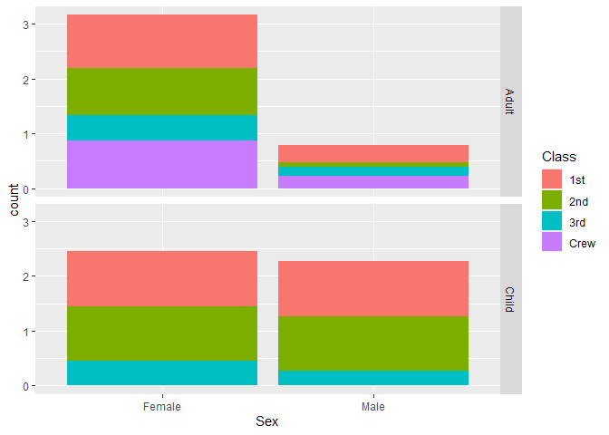

RMS Titanic
================
Sascha Jalinous
2026-

- [Grading Rubric](#grading-rubric)
  - [Individual](#individual)
  - [Submission](#submission)
- [First Look](#first-look)
  - [**q1** Perform a glimpse of `df_titanic`. What variables are in
    this
    dataset?](#q1-perform-a-glimpse-of-df_titanic-what-variables-are-in-this-dataset)
  - [**q2** Skim the Wikipedia article on the RMS Titanic, and look for
    a total count of souls aboard. Compare against the total computed
    below. Are there any differences? Are those differences large or
    small? What might account for those
    differences?](#q2-skim-the-wikipedia-article-on-the-rms-titanic-and-look-for-a-total-count-of-souls-aboard-compare-against-the-total-computed-below-are-there-any-differences-are-those-differences-large-or-small-what-might-account-for-those-differences)
  - [**q3** Create a plot showing the count of persons who *did*
    survive, along with aesthetics for `Class` and `Sex`. Document your
    observations
    below.](#q3-create-a-plot-showing-the-count-of-persons-who-did-survive-along-with-aesthetics-for-class-and-sex-document-your-observations-below)
- [Deeper Look](#deeper-look)
  - [**q4** Replicate your visual from q3, but display `Prop` in place
    of `n`. Document your observations, and note any new/different
    observations you make in comparison with q3. Is there anything
    *fishy* in your
    plot?](#q4-replicate-your-visual-from-q3-but-display-prop-in-place-of-n-document-your-observations-and-note-any-newdifferent-observations-you-make-in-comparison-with-q3-is-there-anything-fishy-in-your-plot)
  - [**q5** Create a plot showing the group-proportion of occupants who
    *did* survive, along with aesthetics for `Class`, `Sex`, *and*
    `Age`. Document your observations
    below.](#q5-create-a-plot-showing-the-group-proportion-of-occupants-who-did-survive-along-with-aesthetics-for-class-sex-and-age-document-your-observations-below)
- [Notes](#notes)

*Purpose*: Most datasets have at least a few variables. Part of our task
in analyzing a dataset is to understand trends as they vary across these
different variables. Unless we’re careful and thorough, we can easily
miss these patterns. In this challenge you’ll analyze a dataset with a
small number of categorical variables and try to find differences among
the groups.

*Reading*: (Optional) [Wikipedia
article](https://en.wikipedia.org/wiki/RMS_Titanic) on the RMS Titanic.

<!-- include-rubric -->

# Grading Rubric

<!-- -------------------------------------------------- -->

Unlike exercises, **challenges will be graded**. The following rubrics
define how you will be graded, both on an individual and team basis.

## Individual

<!-- ------------------------- -->

| Category | Needs Improvement | Satisfactory |
|----|----|----|
| Effort | Some task **q**’s left unattempted | All task **q**’s attempted |
| Observed | Did not document observations, or observations incorrect | Documented correct observations based on analysis |
| Supported | Some observations not clearly supported by analysis | All observations clearly supported by analysis (table, graph, etc.) |
| Assessed | Observations include claims not supported by the data, or reflect a level of certainty not warranted by the data | Observations are appropriately qualified by the quality & relevance of the data and (in)conclusiveness of the support |
| Specified | Uses the phrase “more data are necessary” without clarification | Any statement that “more data are necessary” specifies which *specific* data are needed to answer what *specific* question |
| Code Styled | Violations of the [style guide](https://style.tidyverse.org/) hinder readability | Code sufficiently close to the [style guide](https://style.tidyverse.org/) |

## Submission

<!-- ------------------------- -->

Make sure to commit both the challenge report (`report.md` file) and
supporting files (`report_files/` folder) when you are done! Then submit
a link to Canvas. **Your Challenge submission is not complete without
all files uploaded to GitHub.**

``` r
library(tidyverse)
```

    ## ── Attaching core tidyverse packages ──────────────────────── tidyverse 2.0.0 ──
    ## ✔ dplyr     1.2.1     ✔ readr     2.2.0
    ## ✔ forcats   1.0.1     ✔ stringr   1.6.0
    ## ✔ ggplot2   4.0.3     ✔ tibble    3.3.1
    ## ✔ lubridate 1.9.5     ✔ tidyr     1.3.2
    ## ✔ purrr     1.2.2     
    ## ── Conflicts ────────────────────────────────────────── tidyverse_conflicts() ──
    ## ✖ dplyr::filter() masks stats::filter()
    ## ✖ dplyr::lag()    masks stats::lag()
    ## ℹ Use the conflicted package (<http://conflicted.r-lib.org/>) to force all conflicts to become errors

``` r
df_titanic <- as_tibble(Titanic)
```

*Background*: The RMS Titanic sank on its maiden voyage in 1912; about
67% of its passengers died.

# First Look

<!-- -------------------------------------------------- -->

### **q1** Perform a glimpse of `df_titanic`. What variables are in this dataset?

``` r
## TASK: Perform a `glimpse` of df_titanic
df_titanic %>%
  glimpse()
```

    ## Rows: 32
    ## Columns: 5
    ## $ Class    <chr> "1st", "2nd", "3rd", "Crew", "1st", "2nd", "3rd", "Crew", "1s…
    ## $ Sex      <chr> "Male", "Male", "Male", "Male", "Female", "Female", "Female",…
    ## $ Age      <chr> "Child", "Child", "Child", "Child", "Child", "Child", "Child"…
    ## $ Survived <chr> "No", "No", "No", "No", "No", "No", "No", "No", "No", "No", "…
    ## $ n        <dbl> 0, 0, 35, 0, 0, 0, 17, 0, 118, 154, 387, 670, 4, 13, 89, 3, 5…

**Observations**:

- Class, sex, age, survived, n

### **q2** Skim the [Wikipedia article](https://en.wikipedia.org/wiki/RMS_Titanic) on the RMS Titanic, and look for a total count of souls aboard. Compare against the total computed below. Are there any differences? Are those differences large or small? What might account for those differences?

``` r
## NOTE: No need to edit! We'll cover how to
## do this calculation in a later exercise.
df_titanic %>% summarize(total = sum(n))
```

    ## # A tibble: 1 × 1
    ##   total
    ##   <dbl>
    ## 1  2201

**Observations**:

- The total count according to wikipedia is 2208
- Are there any differences?
  - Yes the database is missing 7 people.
- If yes, what might account for those differences?
  - While attempting to figure out what could account for the
    differences, I accidentally ended up on a different Wikipedia page
    ([Sinking of the Titanic -
    Wikipedia](https://en.wikipedia.org/wiki/Sinking_of_the_Titanic#Casualties_and_survivors)).
    In the third line of the original article, there is a link attached
    to the statistic that 2,208 people were aboard, which I clicked.
    There is then a large table at the bottom that says total people was
    only 2,201. These conflicting numbers both come from Wikipedia so it
    could be that the database makers only took from this table they
    could have missed the 7 people mentioned in the RMS Titanic page.
  - The 2,208 number also does not say where it came from whereas the
    Sinking of the Titanic table says the 2,201 number comes from the
    British Board of Trade so it’s possible discrepancies within record
    keeping over the years have introduced conflicting accounts for how
    many people were aboard the ship.

### **q3** Create a plot showing the count of persons who *did* survive, along with aesthetics for `Class` and `Sex`. Document your observations below.

*Note*: There are many ways to do this.

``` r
# summary(df_titanic)
# df_titanic %>%
#   select(n, everything())
# test <- 
#   df_titanic %>%
#     filter(Survived == "Yes")
# 
# sex_vector = c(test %>% 
#     filter(Sex == "Female") %>%
#       select(n), 
#     test %>% 
#     filter(Sex == "Male") %>%
#       select(n))

## TASK: Visualize counts against `Class` and `Sex`
ggplot(
  data=df_titanic %>%
    filter(Survived == "Yes")
) +
  geom_bar(
    mapping = aes(
      x = Sex, # Sex,
      fill = Class, # Class,
      weight = n
    )
  )
```

<!-- -->

**Observations**:

- Most of the male survivors were part of the crew, while the lowest
  amount of male survivors were in 2nd class.
- Most of the female survivors were in 1st class, while the lowest
  amount of female survivors was in the crew. This number is interesting
  because one thing that comes to mind is the question of just how many
  female crew members were present? I would expect there would be a
  majority of male crew members so it’s possible that this lowest
  survivor count is skewed just by a limited amount of female crew in
  the first place, but I can not accurately say anything definitive
  based on this graph alone.
- In the female section, the amount of survivors in the 2nd and 3rd
  class are similar, whereas in the male section, there is more
  disparity between the survivors in those same categories. I can’t make
  any inferences as to why because the numbers really don’t tell me much
  else except just basic differences.

# Deeper Look

<!-- -------------------------------------------------- -->

Raw counts give us a sense of totals, but they are not as useful for
understanding differences between groups. This is because the
differences we see in counts could be due to either the relative size of
the group OR differences in outcomes for those groups. To make
comparisons between groups, we should also consider *proportions*.\[1\]

The following code computes proportions within each `Class, Sex, Age`
group.

``` r
## NOTE: No need to edit! We'll cover how to
## do this calculation in a later exercise.
df_prop <-
  df_titanic %>%
  group_by(Class, Sex, Age) %>%
  mutate(
    Total = sum(n),
    Prop = n / Total
  ) %>%
  ungroup()
df_prop
```

    ## # A tibble: 32 × 7
    ##    Class Sex    Age   Survived     n Total    Prop
    ##    <chr> <chr>  <chr> <chr>    <dbl> <dbl>   <dbl>
    ##  1 1st   Male   Child No           0     5   0    
    ##  2 2nd   Male   Child No           0    11   0    
    ##  3 3rd   Male   Child No          35    48   0.729
    ##  4 Crew  Male   Child No           0     0 NaN    
    ##  5 1st   Female Child No           0     1   0    
    ##  6 2nd   Female Child No           0    13   0    
    ##  7 3rd   Female Child No          17    31   0.548
    ##  8 Crew  Female Child No           0     0 NaN    
    ##  9 1st   Male   Adult No         118   175   0.674
    ## 10 2nd   Male   Adult No         154   168   0.917
    ## # ℹ 22 more rows

### **q4** Replicate your visual from q3, but display `Prop` in place of `n`. Document your observations, and note any new/different observations you make in comparison with q3. Is there anything *fishy* in your plot?

``` r
ggplot(
  data=df_prop %>%
    filter(Survived == "Yes")
) +
  geom_bar(
    mapping = aes(
      x = Sex, # Sex,
      fill = Class, # Class,
      weight = Prop
    )
  )
```

<!-- -->

**Observations**:

- There were a lot more women survivors than male survivors.
- Majority of survivors were in 1st and 2nd class with 3rd class having
  fewer survivors and the crew having the least survivors.
- The male crew had the least survivors overall.
- Is there anything *fishy* going on in your plot?
  - In the code for calculating the proportions, we group the data by
    Class, Sex, and Age, but then proceed to do nothing with Age besides
    add it to the data, which causes a weird change to the proportions
    that is not accounted for in the graph. The graph only plots Class
    and Sex and nowhere does it mention Age despite it being factored
    into the grouping.
  - The count for male crew survivors is so much lower compared to the
    raw counts because there are no children in the crew so no extra
    individuals are being added to the proportion.

### **q5** Create a plot showing the group-proportion of occupants who *did* survive, along with aesthetics for `Class`, `Sex`, *and* `Age`. Document your observations below.

*Hint*: Don’t forget that you can use `facet_grid` to help consider
additional variables!

``` r
ggplot(
  data=df_prop %>%
    filter(Survived == "Yes")
) +
  geom_bar(
    mapping = aes(
      x = Sex, # Sex,
      fill = Class, # Class,
      weight = Prop
    )
  ) +
    facet_grid(rows = vars(Age))
```

<!-- -->

**Observations**:

- The amount of male and female child survivors is roughly equal which
  makes sense because their age was prioritized, not their sex, which is
  different to the adults.
- The majority of survivors were female adults because their sex was
  prioritized over the male passengers who had much lower counts of
  survival in comparison.
- The smallest group of survivors overall were the ones in 3rd class
  which makes sense because they were the least prioritized.
- The fewest survivors in the adult male categories were those in 2nd
  class which is interesting because you would expect it to be 3rd
  class. I wonder what happened that is not visible in the data set that
  explains this.
- A relatively large proportion of the female crew survived which is
  probably because there were fewer female crew members to begin with.
- If you saw something *fishy* in q4 above, use your new plot to explain
  the fishy-ness.
  - q4’s graph had strange counts due to Age being factored in but not
    being graphed.
  - This new plot separates the survivors based on age which allows for
    a much clear visual and understanding about what the proportions
    actually mean.
  - The difference in female and male survivor proportions was not
    accurately being presented because the male children survivors were
    being included so it skewed the proportions and made it seem like
    the difference in male and female survivors was less than actuality.

# Notes

<!-- -------------------------------------------------- -->

\[1\] This is basically the same idea as [Dimensional
Analysis](https://en.wikipedia.org/wiki/Dimensional_analysis); computing
proportions is akin to non-dimensionalizing a quantity.
