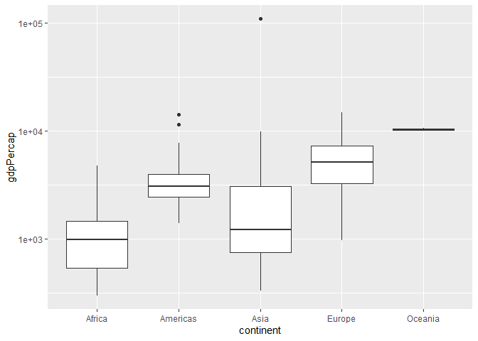
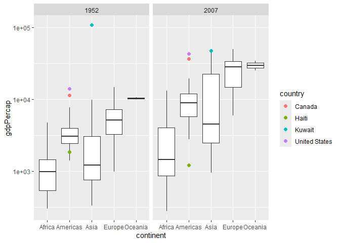
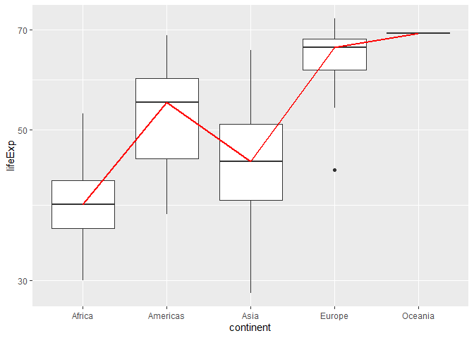
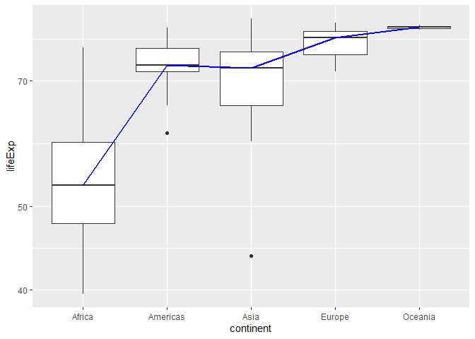
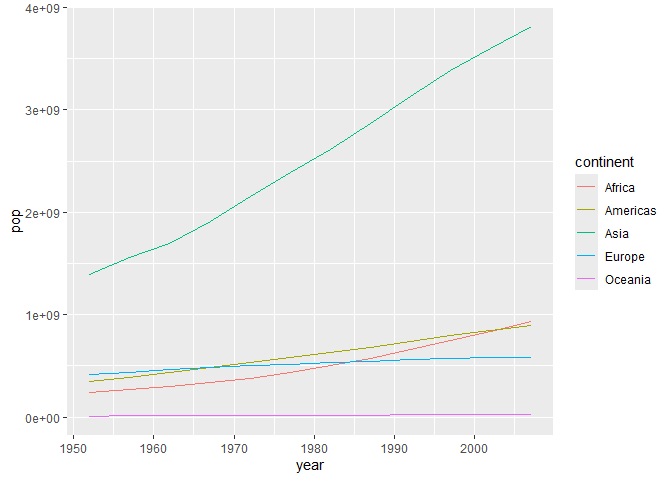
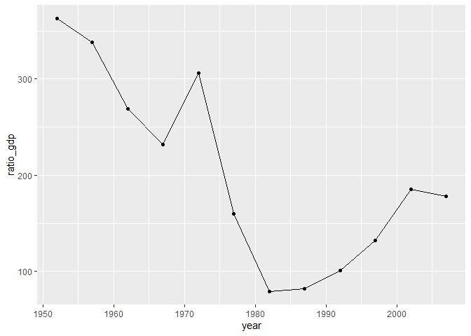
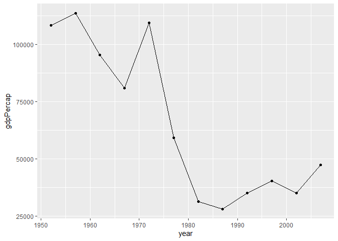
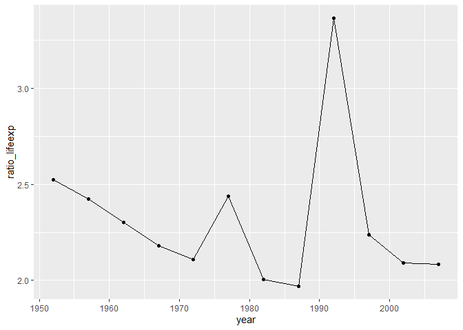
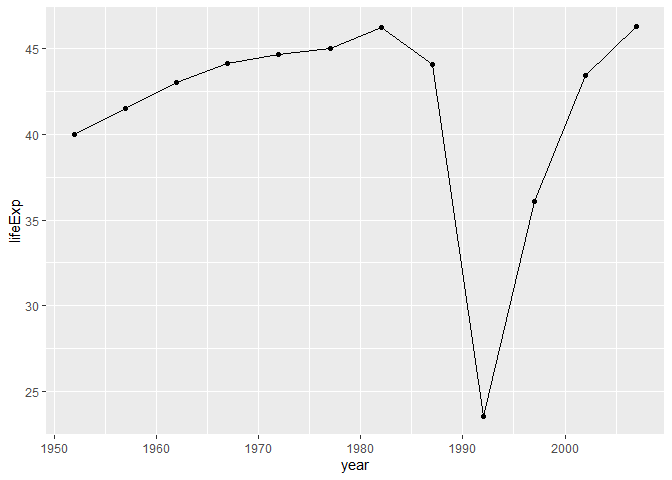
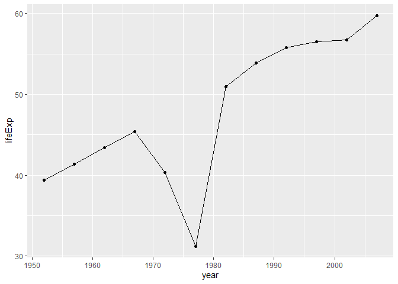

Gapminder
================
Sascha
2026-

- [Grading Rubric](#grading-rubric)
  - [Individual](#individual)
  - [Submission](#submission)
- [Guided EDA](#guided-eda)
  - [**q0** Perform your “first checks” on the dataset. What variables
    are in
    this](#q0-perform-your-first-checks-on-the-dataset-what-variables-are-in-this)
  - [**q1** Determine the most and least recent years in the `gapminder`
    dataset.](#q1-determine-the-most-and-least-recent-years-in-the-gapminder-dataset)
  - [**q2** Filter on years matching `year_min`, and make a plot of the
    GDP per capita against continent. Choose an appropriate `geom_` to
    visualize the data. What observations can you
    make?](#q2-filter-on-years-matching-year_min-and-make-a-plot-of-the-gdp-per-capita-against-continent-choose-an-appropriate-geom_-to-visualize-the-data-what-observations-can-you-make)
  - [**q3** You should have found *at least* three outliers in q2 (but
    possibly many more!). Identify those outliers (figure out which
    countries they
    are).](#q3-you-should-have-found-at-least-three-outliers-in-q2-but-possibly-many-more-identify-those-outliers-figure-out-which-countries-they-are)
  - [**q4** Create a plot similar to yours from q2 studying both
    `year_min` and `year_max`. Find a way to highlight the outliers from
    q3 on your plot *in a way that lets you identify which country is
    which*. Compare the patterns between `year_min` and
    `year_max`.](#q4-create-a-plot-similar-to-yours-from-q2-studying-both-year_min-and-year_max-find-a-way-to-highlight-the-outliers-from-q3-on-your-plot-in-a-way-that-lets-you-identify-which-country-is-which-compare-the-patterns-between-year_min-and-year_max)
- [Your Own EDA](#your-own-eda)
  - [**q5** Create *at least* three new figures below. With each figure,
    try to pose new questions about the
    data.](#q5-create-at-least-three-new-figures-below-with-each-figure-try-to-pose-new-questions-about-the-data)

*Purpose*: Learning to do EDA well takes practice! In this challenge
you’ll further practice EDA by first completing a guided exploration,
then by conducting your own investigation. This challenge will also give
you a chance to use the wide variety of visual tools we’ve been
learning.

<!-- include-rubric -->

# Grading Rubric

<!-- -------------------------------------------------- -->

Unlike exercises, **challenges will be graded**. The following rubrics
define how you will be graded, both on an individual and team basis.

## Individual

<!-- ------------------------- -->

| Category | Needs Improvement | Satisfactory |
|----|----|----|
| Effort | Some task **q**’s left unattempted | All task **q**’s attempted |
| Observed | Did not document observations, or observations incorrect | Documented correct observations based on analysis |
| Supported | Some observations not clearly supported by analysis | All observations clearly supported by analysis (table, graph, etc.) |
| Assessed | Observations include claims not supported by the data, or reflect a level of certainty not warranted by the data | Observations are appropriately qualified by the quality & relevance of the data and (in)conclusiveness of the support |
| Specified | Uses the phrase “more data are necessary” without clarification | Any statement that “more data are necessary” specifies which *specific* data are needed to answer what *specific* question |
| Code Styled | Violations of the [style guide](https://style.tidyverse.org/) hinder readability | Code sufficiently close to the [style guide](https://style.tidyverse.org/) |

## Submission

<!-- ------------------------- -->

Make sure to commit both the challenge report (`report.md` file) and
supporting files (`report_files/` folder) when you are done! Then submit
a link to Canvas. **Your Challenge submission is not complete without
all files uploaded to GitHub.**

``` r
library(tidyverse)
```

    ## ── Attaching core tidyverse packages ──────────────────────── tidyverse 2.0.0 ──
    ## ✔ dplyr     1.2.1     ✔ readr     2.2.0
    ## ✔ forcats   1.0.1     ✔ stringr   1.6.0
    ## ✔ ggplot2   4.0.3     ✔ tibble    3.3.1
    ## ✔ lubridate 1.9.5     ✔ tidyr     1.3.2
    ## ✔ purrr     1.2.2     
    ## ── Conflicts ────────────────────────────────────────── tidyverse_conflicts() ──
    ## ✖ dplyr::filter() masks stats::filter()
    ## ✖ dplyr::lag()    masks stats::lag()
    ## ℹ Use the conflicted package (<http://conflicted.r-lib.org/>) to force all conflicts to become errors

``` r
library(gapminder)
```

*Background*: [Gapminder](https://www.gapminder.org/about-gapminder/) is
an independent organization that seeks to educate people about the state
of the world. They seek to counteract the worldview constructed by a
hype-driven media cycle, and promote a “fact-based worldview” by
focusing on data. The dataset we’ll study in this challenge is from
Gapminder.

# Guided EDA

<!-- -------------------------------------------------- -->

First, we’ll go through a round of *guided EDA*. Try to pay attention to
the high-level process we’re going through—after this guided round
you’ll be responsible for doing another cycle of EDA on your own!

### **q0** Perform your “first checks” on the dataset. What variables are in this

dataset?

``` r
## TASK: Do your "first checks" here!
gapminder %>%
  glimpse()
```

    ## Rows: 1,704
    ## Columns: 6
    ## $ country   <fct> "Afghanistan", "Afghanistan", "Afghanistan", "Afghanistan", …
    ## $ continent <fct> Asia, Asia, Asia, Asia, Asia, Asia, Asia, Asia, Asia, Asia, …
    ## $ year      <int> 1952, 1957, 1962, 1967, 1972, 1977, 1982, 1987, 1992, 1997, …
    ## $ lifeExp   <dbl> 28.801, 30.332, 31.997, 34.020, 36.088, 38.438, 39.854, 40.8…
    ## $ pop       <int> 8425333, 9240934, 10267083, 11537966, 13079460, 14880372, 12…
    ## $ gdpPercap <dbl> 779.4453, 820.8530, 853.1007, 836.1971, 739.9811, 786.1134, …

``` r
gapminder %>%
  summary()
```

    ##         country        continent        year         lifeExp     
    ##  Afghanistan:  12   Africa  :624   Min.   :1952   Min.   :23.60  
    ##  Albania    :  12   Americas:300   1st Qu.:1966   1st Qu.:48.20  
    ##  Algeria    :  12   Asia    :396   Median :1980   Median :60.71  
    ##  Angola     :  12   Europe  :360   Mean   :1980   Mean   :59.47  
    ##  Argentina  :  12   Oceania : 24   3rd Qu.:1993   3rd Qu.:70.85  
    ##  Australia  :  12                  Max.   :2007   Max.   :82.60  
    ##  (Other)    :1632                                                
    ##       pop              gdpPercap       
    ##  Min.   :6.001e+04   Min.   :   241.2  
    ##  1st Qu.:2.794e+06   1st Qu.:  1202.1  
    ##  Median :7.024e+06   Median :  3531.8  
    ##  Mean   :2.960e+07   Mean   :  7215.3  
    ##  3rd Qu.:1.959e+07   3rd Qu.:  9325.5  
    ##  Max.   :1.319e+09   Max.   :113523.1  
    ## 

**Observations**:

- Write all variable names here:
  - Country, continent, year, lifeExp, pop, gdpPercap

### **q1** Determine the most and least recent years in the `gapminder` dataset.

*Hint*: Use the `pull()` function to get a vector out of a tibble.
(Rather than the `$` notation of base R.)

``` r
## TASK: Find the largest and smallest values of `year` in `gapminder`
year_max <- 
  gapminder %>%
  pull(year) %>%
  max()
year_min <- 
  gapminder %>%
  pull(year) %>%
  min()

year_max
```

    ## [1] 2007

``` r
year_min
```

    ## [1] 1952

Use the following test to check your work.

``` r
## NOTE: No need to change this
assertthat::assert_that(year_max %% 7 == 5)
```

    ## [1] TRUE

``` r
assertthat::assert_that(year_max %% 3 == 0)
```

    ## [1] TRUE

``` r
assertthat::assert_that(year_min %% 7 == 6)
```

    ## [1] TRUE

``` r
assertthat::assert_that(year_min %% 3 == 2)
```

    ## [1] TRUE

``` r
if (is_tibble(year_max)) {
  print("year_max is a tibble; try using `pull()` to get a vector")
  assertthat::assert_that(False)
}

print("Nice!")
```

    ## [1] "Nice!"

### **q2** Filter on years matching `year_min`, and make a plot of the GDP per capita against continent. Choose an appropriate `geom_` to visualize the data. What observations can you make?

You may encounter difficulties in visualizing these data; if so document
your challenges and attempt to produce the most informative visual you
can.

``` r
## TASK: Create a visual of gdpPercap vs continent
gapminder %>%
  filter(year == year_min) %>%
  ggplot(
    aes(
      x = continent,
      y = gdpPercap
    )
  ) + 
  geom_boxplot() +
  scale_y_log10()
```

<!-- -->

**Observations**:

- Oceania has the highest gdp while Africa has the lowest gdp.
- There are two outliers in the Americas and one in Asia.
- Oceania has extremely small quantiles.
- The outlier in Asia is a huge outlier compared to the gdp of
  everything else.

**Difficulties & Approaches**:

- The box plots were way too small originally which was fixed by making
  the y axis a log scale.
- It’s difficult to know what countries the outliers are because they’re
  just dots. I can see the next question says identify the outliers so I
  will look at the database and see which ones have the highest gdp.

### **q3** You should have found *at least* three outliers in q2 (but possibly many more!). Identify those outliers (figure out which countries they are).

``` r
## TASK: Identify the outliers from q2
gapminder %>%
  filter(year == year_min) %>%
  filter(continent == "Asia") %>%
  arrange(desc(gdpPercap))
```

    ## # A tibble: 33 × 6
    ##    country          continent  year lifeExp      pop gdpPercap
    ##    <fct>            <fct>     <int>   <dbl>    <int>     <dbl>
    ##  1 Kuwait           Asia       1952    55.6   160000   108382.
    ##  2 Bahrain          Asia       1952    50.9   120447     9867.
    ##  3 Saudi Arabia     Asia       1952    39.9  4005677     6460.
    ##  4 Lebanon          Asia       1952    55.9  1439529     4835.
    ##  5 Iraq             Asia       1952    45.3  5441766     4130.
    ##  6 Israel           Asia       1952    65.4  1620914     4087.
    ##  7 Japan            Asia       1952    63.0 86459025     3217.
    ##  8 Hong Kong, China Asia       1952    61.0  2125900     3054.
    ##  9 Iran             Asia       1952    44.9 17272000     3035.
    ## 10 Singapore        Asia       1952    60.4  1127000     2315.
    ## # ℹ 23 more rows

``` r
gapminder %>%
  filter(year == year_min) %>%
  filter(continent == "Americas") %>%
  arrange(desc(gdpPercap))
```

    ## # A tibble: 25 × 6
    ##    country       continent  year lifeExp       pop gdpPercap
    ##    <fct>         <fct>     <int>   <dbl>     <int>     <dbl>
    ##  1 United States Americas   1952    68.4 157553000    13990.
    ##  2 Canada        Americas   1952    68.8  14785584    11367.
    ##  3 Venezuela     Americas   1952    55.1   5439568     7690.
    ##  4 Argentina     Americas   1952    62.5  17876956     5911.
    ##  5 Uruguay       Americas   1952    66.1   2252965     5717.
    ##  6 Cuba          Americas   1952    59.4   6007797     5587.
    ##  7 Chile         Americas   1952    54.7   6377619     3940.
    ##  8 Peru          Americas   1952    43.9   8025700     3759.
    ##  9 Ecuador       Americas   1952    48.4   3548753     3522.
    ## 10 Mexico        Americas   1952    50.8  30144317     3478.
    ## # ℹ 15 more rows

``` r
gapminder %>%
  filter(year == year_min) %>%
  filter(continent == "Africa") %>%
  arrange(desc(gdpPercap))
```

    ## # A tibble: 52 × 6
    ##    country      continent  year lifeExp      pop gdpPercap
    ##    <fct>        <fct>     <int>   <dbl>    <int>     <dbl>
    ##  1 South Africa Africa     1952    45.0 14264935     4725.
    ##  2 Gabon        Africa     1952    37.0   420702     4293.
    ##  3 Angola       Africa     1952    30.0  4232095     3521.
    ##  4 Reunion      Africa     1952    52.7   257700     2719.
    ##  5 Djibouti     Africa     1952    34.8    63149     2670.
    ##  6 Algeria      Africa     1952    43.1  9279525     2449.
    ##  7 Namibia      Africa     1952    41.7   485831     2424.
    ##  8 Libya        Africa     1952    42.7  1019729     2388.
    ##  9 Congo, Rep.  Africa     1952    42.1   854885     2126.
    ## 10 Mauritius    Africa     1952    51.0   516556     1968.
    ## # ℹ 42 more rows

``` r
gapminder %>%
  filter(year == year_min) %>%
  filter(continent == "Europe") %>%
  arrange(desc(gdpPercap))
```

    ## # A tibble: 30 × 6
    ##    country        continent  year lifeExp      pop gdpPercap
    ##    <fct>          <fct>     <int>   <dbl>    <int>     <dbl>
    ##  1 Switzerland    Europe     1952    69.6  4815000    14734.
    ##  2 Norway         Europe     1952    72.7  3327728    10095.
    ##  3 United Kingdom Europe     1952    69.2 50430000     9980.
    ##  4 Denmark        Europe     1952    70.8  4334000     9692.
    ##  5 Netherlands    Europe     1952    72.1 10381988     8942.
    ##  6 Sweden         Europe     1952    71.9  7124673     8528.
    ##  7 Belgium        Europe     1952    68    8730405     8343.
    ##  8 Iceland        Europe     1952    72.5   147962     7268.
    ##  9 Germany        Europe     1952    67.5 69145952     7144.
    ## 10 France         Europe     1952    67.4 42459667     7030.
    ## # ℹ 20 more rows

``` r
gapminder %>%
  filter(year == year_min) %>%
  filter(continent == "Oceania") %>%
  arrange(desc(gdpPercap))
```

    ## # A tibble: 2 × 6
    ##   country     continent  year lifeExp     pop gdpPercap
    ##   <fct>       <fct>     <int>   <dbl>   <int>     <dbl>
    ## 1 New Zealand Oceania    1952    69.4 1994794    10557.
    ## 2 Australia   Oceania    1952    69.1 8691212    10040.

**Observations**:

- Identify the outlier countries from q2
  - Kuwait, United States, Canada
  - Looking at the other continents, the other highest gdp’s are not as
    intense outliers as those three because the difference between
    Venezuela and Canada is 3,678 and the difference between Kuwait and
    Bahrain is 98,515. In the other three continents the differences
    between the highest 2 values and third highest are much smaller like
    432 in Africa, 116 in Europe, and 517 in Oceania.

*Hint*: For the next task, it’s helpful to know a ggplot trick we’ll
learn in an upcoming exercise: You can use the `data` argument inside
any `geom_*` to modify the data that will be plotted *by that geom
only*. For instance, you can use this trick to filter a set of points to
label:

``` r
## NOTE: No need to edit, use ideas from this in q4 below
gapminder %>%
  filter(year == max(year)) %>%

  ggplot(aes(continent, lifeExp)) +
  geom_boxplot() +
  geom_point(
    data = . %>% filter(country %in% c("United Kingdom", "Japan", "Zambia")),
    mapping = aes(color = country),
    size = 2
  )
```

<!-- -->

### **q4** Create a plot similar to yours from q2 studying both `year_min` and `year_max`. Find a way to highlight the outliers from q3 on your plot *in a way that lets you identify which country is which*. Compare the patterns between `year_min` and `year_max`.

*Hint*: We’ve learned a lot of different ways to show multiple
variables; think about using different aesthetics or facets.

``` r
## TASK: Create a visual of gdpPercap vs continent
gapminder %>%
  # drop_na() %>%
  #filter(year == max(year)) %>%
  filter(year == min(year) | year == max(year)) %>%
  # filter(!(year_max == FALSE & year_min == FALSE)) %>%
  # droplevels() %>%
  ggplot(
    aes(
      x = continent, 
      y = gdpPercap)) +
  geom_boxplot() +
  geom_point(
    data = . %>% filter(country %in% c("United States", "Kuwait", "Canada", "Haiti")),
    mapping = aes(color = country),
    size = 2
  ) +
  # facet_wrap(
  #   facets = vars(year == max(year), year == min(year))) +
  #   ~ year == year_max) +
  # facet_grid(
  #   rows = vars(year == max(year)), 
  #   cols = vars(year == min(year))
  # ) +
  facet_wrap(~ year) +
  scale_y_log10()
```

<!-- -->

**Observations**:

- Oceania started out with a very low range gdp that was the highest,
  and maintained a very high gdp in 2007 with a bit wider of a range.
- As time has gone on, gdp for every continent has increased.
- A very low outlier was introduced in 2007 in the Americas (Haiti) that
  was not there when graphing the 1952 graph originally.
- In 1952 Asia had the widest range of gdp, which continued in 2007 and
  the range got even wider.
- Africa has the lowest median in both graphs, despite increasing in
  2007.
- The continent with the median that rose the highest between the two
  years is Europe.
- Kuwait is an outlier in both years, but in 1952 it was much more
  drastically ahead of everyone else but by 2007 its had gdp fallen
  dramatically.

# Your Own EDA

<!-- -------------------------------------------------- -->

Now it’s your turn! We just went through guided EDA considering the GDP
per capita at two time points. You can continue looking at outliers,
consider different years, repeat the exercise with `lifeExp`, consider
the relationship between variables, or something else entirely.

### **q5** Create *at least* three new figures below. With each figure, try to pose new questions about the data.

``` r
gapminder %>%
  filter(year == year_min) %>%
  ggplot(
    aes(
      x = continent,
      y = lifeExp
    )
  ) + 
  geom_boxplot() +
  scale_y_log10() +
  stat_summary(fun = median,
             geom = "line",
             size = 1,
             aes(group = 1),
             col = "red")
```

    ## Warning: Using `size` aesthetic for lines was deprecated in ggplot2 3.4.0.
    ## ℹ Please use `linewidth` instead.
    ## This warning is displayed once per session.
    ## Call `lifecycle::last_lifecycle_warnings()` to see where this warning was
    ## generated.

<!-- -->

- There is a lot of zig-zagging between the medians of the continents
  that shows the amount of disparity in the medians.
- Question: why is Oceania’s life expectancy so much higher than
  everywhere else?

``` r
## TASK: Your second graph
gapminder %>%
  filter(year == year_max) %>%
  ggplot(
    aes(
      x = continent,
      y = lifeExp
    )
  ) + 
  geom_boxplot() +
  scale_y_log10() + 
  # geom_smooth(method = "lm", color="blue")
  stat_summary(fun = median,
               geom = "line",
               size = 1,
               aes(group = 1),
               col = "blue")
```

<!-- -->

- There is less zig-zagging between the continents which shows that over
  time life expectancy for the Americas, Asia, Europe, and Oceania
  became very similar.
- Africa’s life expectancy increased but there was still a large
  disparity between it and all of the other continents.
- Question: why is Africa’s life expectancy so much lower than the other
  four continents?

``` r
gapminder %>%
  group_by(year, continent) %>%
  summarize(pop = sum(pop)) %>%
  ggplot(aes(year, pop, color = continent)) +
  geom_line()
```

    ## `summarise()` has regrouped the output.
    ## ℹ Summaries were computed grouped by year and continent.
    ## ℹ Output is grouped by year.
    ## ℹ Use `summarise(.groups = "drop_last")` to silence this message.
    ## ℹ Use `summarise(.by = c(year, continent))` for per-operation grouping
    ##   (`?dplyr::dplyr_by`) instead.

<!-- -->

- Asia has consistently had the biggest population.

- Europe’s population has been slowly increasing over the span of this
  data set.

- Oceania went from an inconceivable speck to a slightly observable
  lines which shows the drastic difference in population size. I googled
  it and today Oceania has a population size of around 46 million
  according to Wikipedia so it is super small compared to every other
  continent.

- Question: Why is Oceania’s population barely changing at all?

``` r
gapminder %>%
  group_by(year) %>%
  summarize(
    ratio_gdp = max(gdpPercap) / min(gdpPercap)
  ) %>%
  ggplot(aes(year, ratio_gdp)) +
  geom_line() +
  geom_point()
```

<!-- -->

This is a graph of the ratio of the highest/lowest gdp of all the
countries over the years.

- There is a large spike in 1972 after a decline and then a sharp fall
  off afterward.
- Question: what caused the large spike in 1972?

``` r
gapminder %>%
  filter(country == "Kuwait") %>%
  ggplot(aes(year, gdpPercap)) +
  geom_line() +
  geom_point()
```

<!-- -->

``` r
gpd_guh <- 
  gapminder %>% filter( year == 1972) %>% 
  arrange(desc(gdpPercap)) 
gpd_guh
```

    ## # A tibble: 142 × 6
    ##    country       continent  year lifeExp       pop gdpPercap
    ##    <fct>         <fct>     <int>   <dbl>     <int>     <dbl>
    ##  1 Kuwait        Asia       1972    67.7    841934   109348.
    ##  2 Switzerland   Europe     1972    73.8   6401400    27195.
    ##  3 Saudi Arabia  Asia       1972    53.9   6472756    24837.
    ##  4 United States Americas   1972    71.3 209896000    21806.
    ##  5 Libya         Africa     1972    52.8   2183877    21011.
    ##  6 Canada        Americas   1972    72.9  22284500    18971.
    ##  7 Norway        Europe     1972    74.3   3933004    18965.
    ##  8 Denmark       Europe     1972    73.5   4991596    18866.
    ##  9 Netherlands   Europe     1972    73.8  13329874    18795.
    ## 10 Bahrain       Asia       1972    63.3    230800    18269.
    ## # ℹ 132 more rows

I looked at the data set to see what country had the highest gdp ratio
and it didn’t surprise me when it was Kuwait since Kuwait was the
massive gdp outlier in 1952. Doing some research, this was most likely
caused by a stock market boom due to oil revenue which eventually
crashed the economy in 1977.

``` r
gapminder %>%
  group_by(year) %>%
  summarize(
    ratio_lifeexp = max(lifeExp) / min(lifeExp)
  ) %>%
  ggplot(aes(year, ratio_lifeexp)) +
  geom_line() +
  geom_point()
```

<!-- -->

This is a graph showing the ratio of the highest/lowest life expectancy
of all the countries over the years.

- There is a huge spike in 1992 which means that there was a huge
  disparity in ratio.

- This is a smaller but still noticeable spike in 1977 which means there
  was a large disparity in ratio again.

- Question: what are the two large spikes in 1977 and 1992?

``` r
gapminder %>%
  filter(country == "Rwanda") %>%
  ggplot(aes(year, lifeExp)) +
  geom_line() +
  geom_point()
```

<!-- -->

``` r
rwanda <-
  gapminder %>%
  filter(
    year == 1992) %>%
  arrange(desc(lifeExp))
rwanda
```

    ## # A tibble: 142 × 6
    ##    country          continent  year lifeExp       pop gdpPercap
    ##    <fct>            <fct>     <int>   <dbl>     <int>     <dbl>
    ##  1 Japan            Asia       1992    79.4 124329269    26825.
    ##  2 Iceland          Europe     1992    78.8    259012    25144.
    ##  3 Sweden           Europe     1992    78.2   8718867    23880.
    ##  4 Switzerland      Europe     1992    78.0   6995447    31872.
    ##  5 Canada           Americas   1992    78.0  28523502    26343.
    ##  6 Hong Kong, China Asia       1992    77.6   5829696    24758.
    ##  7 Spain            Europe     1992    77.6  39549438    18603.
    ##  8 Australia        Oceania    1992    77.6  17481977    23425.
    ##  9 France           Europe     1992    77.5  57374179    24704.
    ## 10 Italy            Europe     1992    77.4  56840847    22014.
    ## # ℹ 132 more rows

The large disparity in 1992 is due to the fact that Japan had the
highest life expectancy with 79 years while Rwanda had a life expectancy
of 23. Upon doing some research, this is most likely due to the Rwandan
Genocide which started in 1992, ramped up in 1994 and decreased
afterward which would explain the extremely low life expectancy during
that time period.

``` r
gapminder %>%
  filter(country == "Cambodia") %>%
  ggplot(aes(year, lifeExp)) +
  geom_line() +
  geom_point()
```

<!-- -->

``` r
cambodia <-
  gapminder %>%
  filter(
    year == 1977) %>%
  arrange(desc(lifeExp))
cambodia
```

    ## # A tibble: 142 × 6
    ##    country     continent  year lifeExp       pop gdpPercap
    ##    <fct>       <fct>     <int>   <dbl>     <int>     <dbl>
    ##  1 Iceland     Europe     1977    76.1    221823    19655.
    ##  2 Sweden      Europe     1977    75.4   8251648    18856.
    ##  3 Switzerland Europe     1977    75.4   6316424    26982.
    ##  4 Japan       Asia       1977    75.4 113872473    16610.
    ##  5 Norway      Europe     1977    75.4   4043205    23311.
    ##  6 Netherlands Europe     1977    75.2  13852989    21209.
    ##  7 Denmark     Europe     1977    74.7   5088419    20423.
    ##  8 Spain       Europe     1977    74.4  36439000    13237.
    ##  9 Canada      Americas   1977    74.2  23796400    22091.
    ## 10 France      Europe     1977    73.8  53165019    18293.
    ## # ℹ 132 more rows

The smaller disparity in 1977 is due to the life expectancy of Iceland
being 76 years while the life expectancy of Cambodia was 31 years. Doing
some research, this is most likely due to the Cambodian Genocide which
started in 1975 and ended in 1979 which would account for the extreme
drop in life expectancy.
